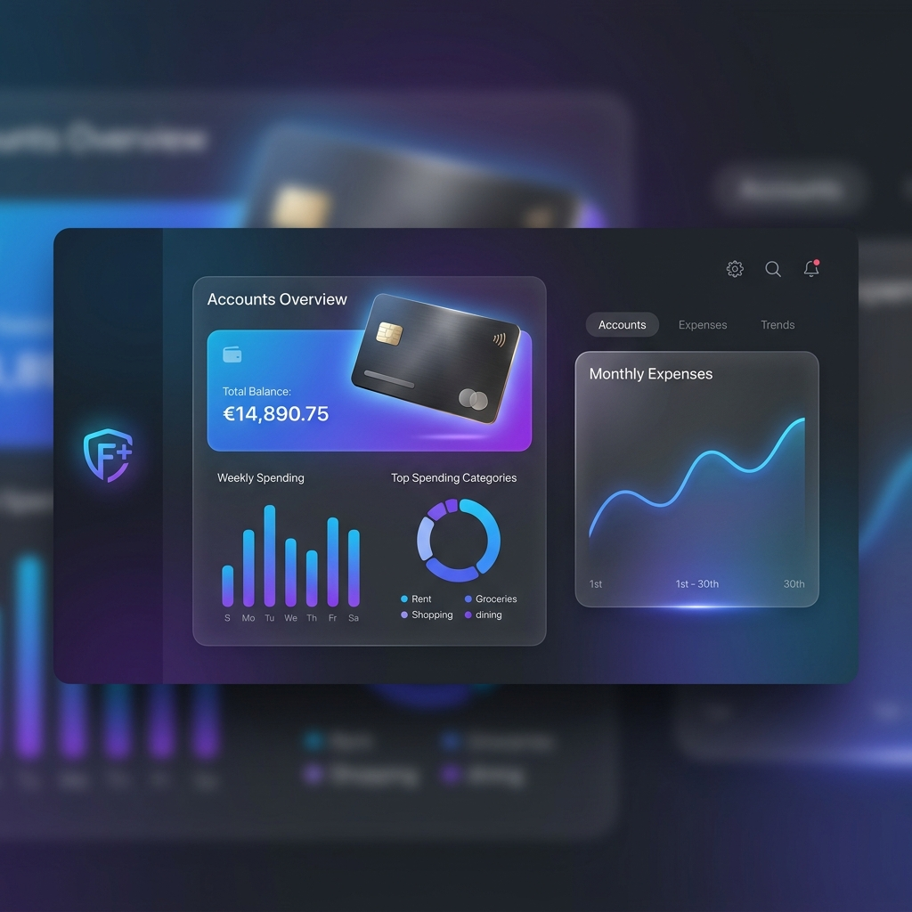

<div align="center">
  

  # 💎 FinançasPlus
  ### Gestão Financeira Premium & Minimalista
  
  *Dashboard inteligente com previsão de saldo e física de movimento estilo iOS.*

  [](https://nextjs.org/)
  [](https://tailwindcss.com/)
  [](https://www.prisma.io/)
  [](https://www.framer.com/motion/)

</div>

---

## ✨ Funcionalidades

- 📱 **Interface Apple-Style**: Design limpo, focado em tipografia e proporções perfeitas.
- 📊 **Dashboard Inteligente**: Visão geral de saldo, despesas e previsões em tempo real.
- 💳 **Gestão de Cartões**: Acompanhamento detalhado de limites e faturas.
- 🏦 **Contas Multibanco**: Gerencie múltiplas contas em um único lugar.
- 📈 **Relatórios Visuais**: Gráficos dinâmicos com Recharts para análise de gastos.
- 🌑 **Dark Mode Nativo**: Estética premium com glassmorphism e efeitos de desfoque.

## 🚀 Tech Stack

- **Framework**: [Next.js 15](https://nextjs.org/) (App Router)
- **Estilização**: [Tailwind CSS 4](https://tailwindcss.com/)
- **Animações**: [Framer Motion](https://www.framer.com/motion/)
- **Backend/ORM**: [Prisma](https://www.prisma.io/)
- **Visualização de Dados**: [Recharts](https://recharts.org/)
- **Validação**: [Zod](https://zod.dev/) & [React Hook Form](https://react-hook-form.com/)

## 🛠️ Instalação

```bash
# Clone o repositório
git clone https://github.com/GabrielHJM/FINANCASPESSOAIS

# Instale as dependências
npm install

# Configure o banco de dados (Prisma)
npx prisma generate
npx prisma db push

# Rode o projeto
npm run dev
```

---

<div align="center">
  Desenvolvido com ❤️ por GabrielHJM
</div>
